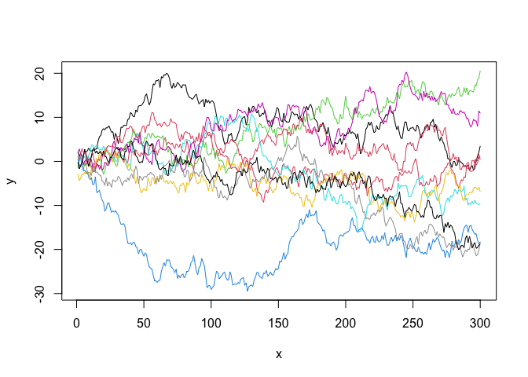
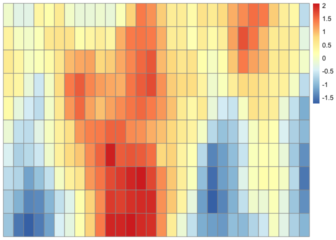

<!-- README.md is generated from README.Rmd. Please edit that file -->

# GPcov

<!-- badges: start -->
<!-- badges: end -->

`GPcov` provides functions to create a covariance matrix for Gaussian
processes with different dependence models

## Installation

You can install the most recent version of `GPcov` in the following way

``` r
library(devtools)
devtools::install.github("avramaral/GPcov")
```

## Example

As a simple example, suppose we want to simulate `n = 10` curves from a
zero-mean Gaussian process covariance function given by
 = \min(x_p, x_q)")
(namely Brownian Motion). This can be achieved by using the
`compute_cov_matrix()` function from `GPcov` package, and the
`mvrnorm()` function from the `MASS` package.

``` r
library(GPcov)
library(MASS)

set.seed(1)

x <- data.frame(seq(from = 1, to = 300, by = 1))
C <- compute_cov_matrix(points = x, cov_func = "brownian_motion")

GP <- mvrnorm(n = 10, mu = rep(0, nrow(C)), Sigma = as.matrix(C))
plot(GP[1, ], type = 'l', ylim = c(min(GP), max(GP)), xlab = 'x', ylab = 'y')
for (i in 2:nrow(GP)) {
  lines(GP[i, ], col = i)
}
```



Alternatively, suppose we want to simulate a Matérn process in
.
This can be done in the following way.

``` r
library(pheatmap)

x <- seq(1, 30)
y <- seq(1, 10)
z <- expand.grid(x, y)

C  <- compute_cov_matrix(points = z, cov_func = "matern_model", sig2 = 1, nu = 1, beta = 5)
GP <- mvrnorm(n = 1, mu = rep(0, nrow(C)), Sigma = as.matrix(C))
GP <- matrix(data = GP, nrow = length(y), ncol = length(x), byrow = TRUE)
pheatmap::pheatmap(GP, cluster_rows = FALSE, cluster_cols = FALSE)
```


